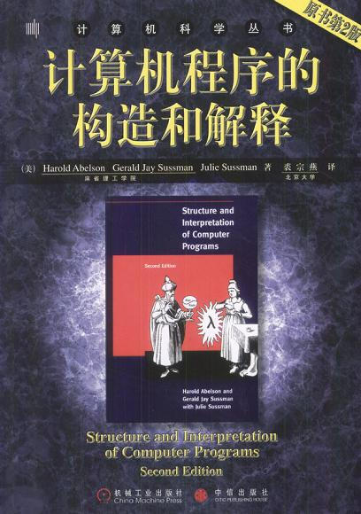
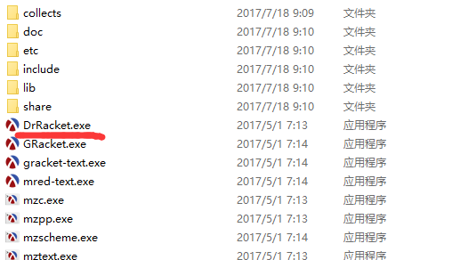
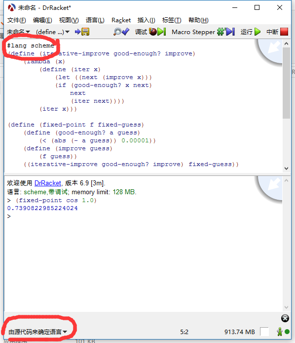

# 学习 SICP 过程中，将答案都记录在这里，仅供参考
## 中文译本
计算机程序的构造与解释

## 使用 racket
[下载地址](https://racket-lang.org/download/)

使用 DrRacket

设置由源码来确定语言

## 部分参考
http://sicp.readthedocs.io/en/latest/
## 学习交流
QQ 648917857